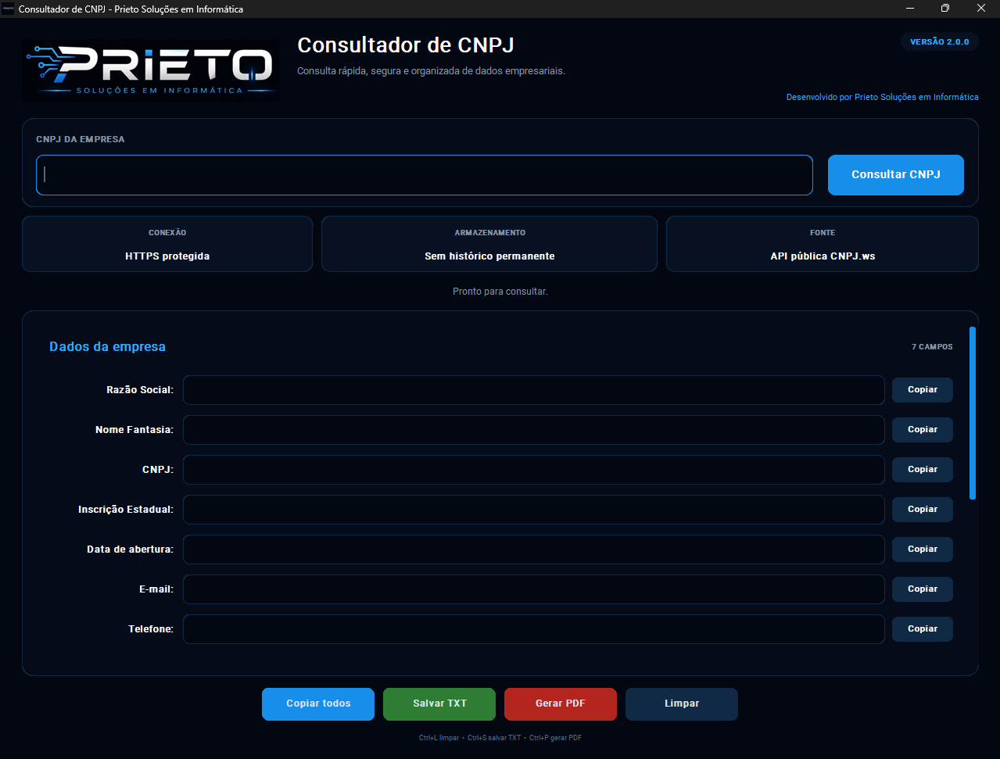
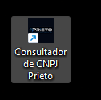
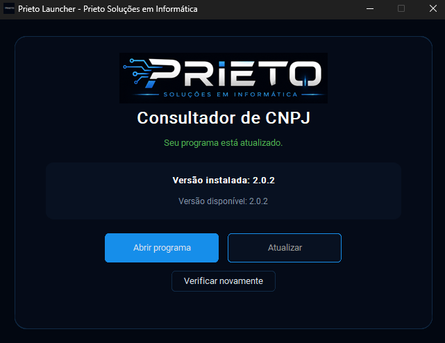

# Consultador de CNPJ Prieto

Aplicativo desktop para Windows desenvolvido em Python para consulta de dados cadastrais de empresas brasileiras.

**Versão atual: v2.0.2**

> Este repositório é apenas demonstrativo.  
> O código-fonte completo, o executável, o instalador e a estrutura usada para distribuir atualizações ficam em repositório privado.

## Sobre o projeto

Comecei este projeto com a ideia de criar uma consulta simples de CNPJ usando uma interface desktop.

Conforme fui desenvolvendo, fui adicionando outras partes que achei interessantes para estudar na prática, como validação de dados, exportação em PDF e TXT, empacotamento para Windows, instalador e, mais recentemente, um launcher próprio para controle de versões e atualizações.

Os dados cadastrais são consultados através da **API Pública CNPJ.ws**.

## O que o programa faz

- consulta empresas por CNPJ;
- valida o CNPJ antes da consulta;
- aplica máscara durante a digitação;
- exibe razão social, nome fantasia e endereço;
- mostra situação cadastral do CNPJ;
- exibe informações de Inscrição Estadual quando disponíveis;
- permite copiar campos individualmente ou todos os dados de uma vez;
- exporta os dados para TXT;
- gera relatório em PDF;
- faz as requisições sem travar a interface;
- não mantém histórico permanente das consultas.

## Aplicação para Windows

Além da parte da consulta, também trabalhei na distribuição do programa para Windows.

O projeto possui:

- executável gerado com PyInstaller;
- instalador criado com Inno Setup;
- atalho na Área de Trabalho;
- desinstalador;
- launcher próprio para abrir o programa e verificar atualizações.

## Launcher e atualizações

O launcher foi uma das últimas partes que adicionei ao projeto.

Ele verifica qual versão está instalada e consulta se existe uma versão mais nova disponível. Quando há atualização, o próprio launcher pode baixar o novo instalador e iniciar o processo de atualização.

Antes da instalação, o arquivo baixado é validado usando **SHA-256**.

As versões usadas pelo sistema de atualização ficam em ambiente privado. Por isso, detalhes de autenticação e credenciais não são expostos neste repositório.

## Tecnologias e ferramentas

- Python
- CustomTkinter
- Requests
- Pillow
- ReportLab
- PyInstaller
- Inno Setup
- GitHub
- API Pública CNPJ.ws

## Segurança e tratamento de dados

Alguns cuidados que implementei durante o desenvolvimento:

- comunicação via HTTPS;
- validação do CNPJ antes da requisição;
- timeout de conexão e leitura;
- tratamento de exceções;
- bloqueio de redirecionamentos;
- sanitização dos dados recebidos;
- ausência de histórico permanente;
- validação SHA-256 nos arquivos de atualização.

## Fonte dos dados

As informações exibidas pelo programa são obtidas através da **API Pública CNPJ.ws**.

O projeto não possui vínculo oficial com o CNPJ.ws e não representa a plataforma.

A aplicação, a interface, a identidade visual e a integração com a API foram desenvolvidas por mim como parte dos meus estudos.

## O que estudei com este projeto

Esse projeto acabou sendo útil para praticar várias partes diferentes do desenvolvimento, entre elas:

- consumo de API REST;
- tratamento de JSON;
- criação de interface desktop;
- organização de código em módulos;
- requisições em segundo plano;
- geração de PDF;
- exportação de arquivos;
- empacotamento de aplicações Python;
- criação de instalador para Windows;
- versionamento;
- criação de launcher;
- download e validação de atualizações;
- distribuição de software.

## Objetivo

Este é um **projeto de estudos e portfólio**.

A ideia é continuar evoluindo o programa conforme eu for aprendendo novas coisas e encontrando pontos que façam sentido melhorar.

## Autor

**Luis Felipe Prieto**  
Prieto Soluções em Informática

---

Os nomes, marcas e dados exibidos nas demonstrações pertencem aos seus respectivos titulares.
